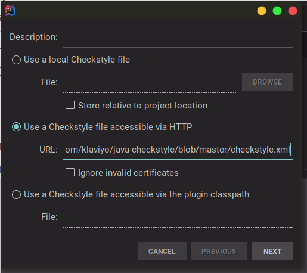

# java-checkstyle
Klaviyo's Java Checkstyle config based on [Google's](http://checkstyle.sourceforge.net/google_style.html)

# Installation
## Gradle
Integrating Klaviyo's Checkstyle config into a gradle project is a little more involved, but can be accomplished with a custom task and defining that custom task as a dependency of the checkstyle task.
```properties
# gradle.properties
checkstyleXmlUrl=https://raw.githubusercontent.com/klaviyo/java-checkstyle/master/checkstyle.xml
checkstyleConfigDir=config/checkstyle
checkstyleLocalPath=config/checkstyle/checkstyle.xml
# NOTE: in theory the above 2 values for checkstyle dir/path are configurable,
#       however they are here to document the default values because I was not
#       able to get the checkstyle gradle plugin to accept any other values.
```

```groovy
// build.gradle
task lint(type: GradleBuild) {
    tasks = ['getCheckstyle', 'checkstyleMain']
}

// NOTE: this line is required to make checkstyle not go crazy linting generated source files
checkstyleMain.source = "src/main/java"

task getCheckstyle {
    doLast {
        // check if the config dir was created yet
        def checkstyleConfigDir = new File(checkstyleConfigDir)
        if (!checkstyleConfigDir.exists()) {
            checkstyleConfigDir.mkdirs()
        }

        // save the remote file down if it doesn't exist
        def checkstyleConfig = new File(checkstyleLocalPath)
        if (!checkstyleConfig.exists()) {
            println "Downloading ${checkstyleXmlUrl}"
            checkstyleConfig << new URL(checkstyleXmlUrl).getText()
        }
    }
}
tasks.checkstyleMain.dependsOn('getCheckstyle')
tasks.checkstyleTest.dependsOn('getCheckstyle')
```

## Maven
To integrate Klaviyo's Checkstyle configuration into a maven build, add the following to your project's `pom.xml`
```xml
  <build>
    <plugins>
      <plugin>
        <groupId>org.apache.maven.plugins</groupId>
        <artifactId>maven-checkstyle-plugin</artifactId>
        <version>3.0.0</version>
        <configuration>
          <configLocation>
            https://raw.githubusercontent.com/klaviyo/java-checkstyle/master/checkstyle.xml
          </configLocation>
        </configuration>
        <dependencies>
          <dependency>
            <groupId>com.puppycrawl.tools</groupId>
            <artifactId>checkstyle</artifactId>
            <version>8.11</version>
          </dependency>
        </dependencies>
      </plugin>
    </plugins>
  </build>
```

## IntellijIDEA
- Install the checkstyle plugin from the plugin browser or from [github](https://github.com/jshiell/checkstyle-idea)
- Once installed, open settings and navigate to `Other Settings` > `Checkstyle`
- Check `Treat Checkstyle errors as warnings` so you can distinguish between actual java syntax errors and simple linting errors
- Hit the plus button on the right side of the settings window to add a new configuration file and select file from HTTP. Make sure you use the [raw content link](https://github.com/klaviyo/java-checkstyle/raw/master/checkstyle.xml), not the prettified HTML view link.

